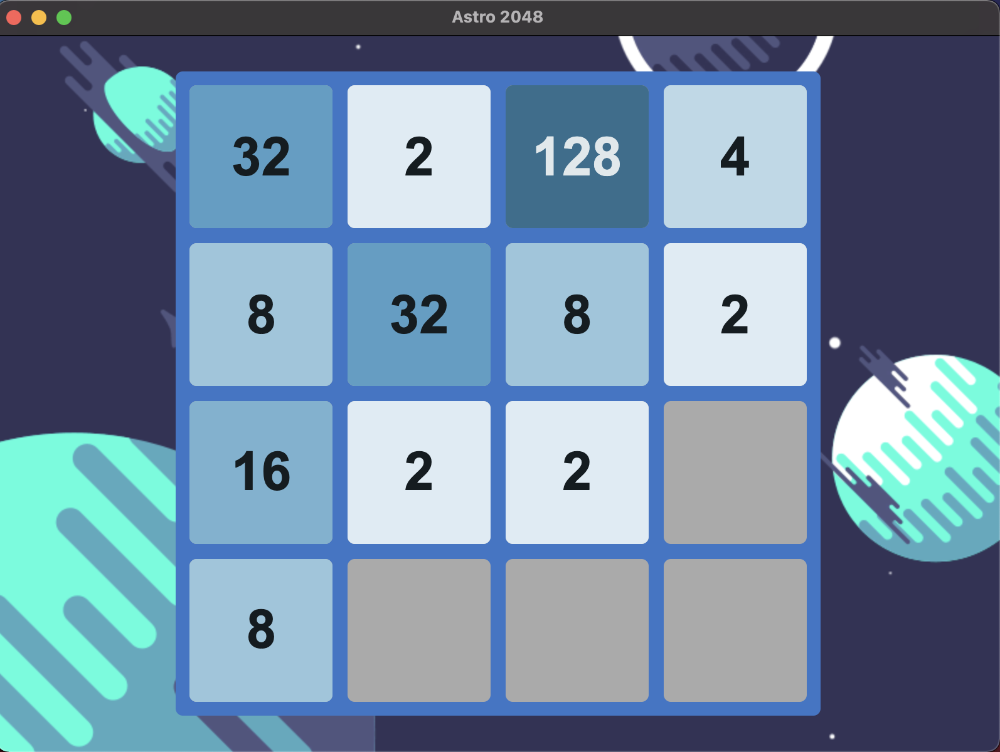

# Astro 2048

## **Description**

Astro 2048 is a new space-themed version of the classic and beloved 2048 game. Are you up for the challenge? Many players have tried to get the eluding 2048, very few achieved this greatness.

## **How to play**

- Combine tiles of the same number in an attempt to create a tile with the value 2048.
- Pressing the arrow keys or swiping across the game board will move all tiles in the direction of the key pressed/swipe. After all the tiles are done moving a new tile with the value of 2 or 4 will be created in a random empty cell.
- Two tiles with the same number will merge when they collide to create a single tile with double the value.
- The game is over when there are no valid ways for you to move the tiles.

## **How to Contribute**

1. Clone repo and create a new branch: `$ git checkout https://github.com/FromZeroToCicero/Astro_2048 -b name_for_new_branch`.
2. Make changes and test
3. Submit Pull Request with comprehensive description of changes
